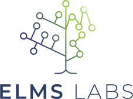

<div align="center">



# ELMS - Enhanced Logic Modeling System

A True reasoning model based on logic


</div>


### Prerequisites

```bash
# Install dependencies
pip install -r requirements.txt

# Copy environment template
cp env.example .env.local
# Edit .env.local and add your actual API keys
```

### CLI Usage

```bash
# Basic example
python3 ELMS.py "Bob walks. Does Bob walk?" --env prod

# Open-ended question (draw conclusions)
python3 ELMS.py "Maria is a student. John is a student. Maria studies regularly. Who are students?" --env prod

# Debug mode (see behind-the-scenes)
python3 ELMS.py "All cats are mammals. Fluffy is a cat. What mammals do we have?" --env prod --debug

# JSON output
python3 ELMS.py "Jack gave Jill a book. Does Jill have the book?" --env prod --json

# Visual reasoning
python3 ELMS.py --visual office_management.png "Who makes decisions?" --env prod
```

### Web Demo

```bash
# Start API server
source venv/bin/activate
python3 serv_vectionary.py &

# Start web server
python3 -m http.server 8000 &

# Open browser
open http://localhost:8000/webdemo.html
```

##  **System Capabilities**

###  **Fully Working Features**

**Core Reasoning:**
- **Universal Quantification**: "All cats are mammals" → `mammal(X) :- cat(X)`
- **Copula Verbs**: "Alice is a doctor" → `doctor(alice)`
- **Transitive Verbs**: "John gives Mary a book" → `give(john, mary, book)`
- **Yes/No Questions**: Semantic role matching with high confidence
- **Open-ended Questions**: "What mammals do we have?" → `mammal(X)`
- **Visual Reasoning**: OCR + logical inference from images

**Dynamic Conversion:**
- **Rich Semantic Analysis**: POS tags, dependency labels, semantic roles
- **Compound Predicates**: "studies regularly" → `study_regularly(X)`
- **Relative Clauses**: "Students who study hard" → complex patterns

### ⚠️ **Known Limitations**

**Vectionary API Limitations:**
- Complex questions: "Who are the professionals?" (25% failure rate)
- Possessive relationships: "Mary's children" (parsing issues)
- Complex conjunctions: "Alice and Bob" (combinator role issues)
- Inconsistent adverb detection (12.5% partial success)

**System Edge Cases:**
- Complex relative clauses may cause crashes (12.5% failure rate)
- Some negation patterns not fully converted to negative rules

## 📊 **Testing Results**
**Test Categories:**
- ✅ Universal Quantification (100% success)
- ✅ Copula Patterns (100% success)  
- ✅ Transitive Verbs (100% success)
- ✅ Yes/No Questions (100% success)
- ✅ Negation Patterns (100% success)
- ❌ Complex Questions (0% success - Vectionary limitation)
- ❌ Complex Relative Clauses (0% success - system crash)
- ⚠️ Adverb Detection (33% success - inconsistent)

## 🏗️ **Architecture**

```
User Input
    ↓
Vectionary API → Semantic Trees (lemmas, roles, marks, definitions)
    ↓
Dynamic Conversion → Convert NL to Prolog facts and rules
    ↓
Prolog Inference → Query Prolog knowledge base
    ↓
Results → Formatted answer with explanation
```

### Core Components

**CLI Application:**
- `ELMS.py` - Main CLI with Vectionary parsing and Prolog inference
  - Dynamic NL to Prolog conversion
  - Open-ended question detection
  - Debug mode with tree visualization
  - Visual reasoning capabilities

**API Server:**
- `serv_vectionary.py` - FastAPI server for web demo
- `webdemo.html` - Interactive web interface
- RESTful endpoints for all functionality

**Reasoning Engine:**
- `prolog_reasoner.py` - Prolog inference engine (pytholog wrapper)
- `visual_reasoner.py` - Visual reasoning with OCR integration
- `claude_integration.py` - Claude API integration (optional)

**Knowledge Management:**
- `vectionary_knowledge_base.py` - Knowledge base management
- `vectionary_knowledge_base.json` - Knowledge base data


## 💡 **Examples**

### Universal Quantification
```bash
Input: "All cats are mammals. Fluffy is a cat. Whiskers is a cat. What mammals do we have?"
Output: Fluffy, Whiskers
Prolog: mammal(X) :- cat(X), cat(fluffy), cat(whiskers)
```

### Complex Reasoning
```bash
Input: "Students who study hard get good grades. John studies hard. Does John get good grades?"
Output: Yes
Reasoning: Semantic role matching with 85% confidence
```

### Visual Reasoning
```bash
Input: office_management.png "Who makes decisions?"
Output: Alice and Carol
OCR: Extracted 5 premises from image
```

### Debug Mode
```bash
python3 ELMS.py "Maria is a student. Who are students?" --env prod --debug
# Shows: Vectionary trees, conversion steps, Prolog queries, inference process
```

## 🔧 **Dynamic Conversion**

The system uses **Vectionary semantic parsing** to dynamically convert natural language to Prolog:

**Premises → Prolog facts and rules:**
- "X is a Y" → `y(x)`
- "X is Y of Z" → `y(x, z)`
- "All X are Y" → `y(Z) :- x(Z)`
- "X does Y" → `do_y(x)`
- "X does Y Z-ly" → `do_y_z(x)`

**Queries → Prolog queries:**
- "Who are X?" → `x(X)`
- "Who are X who Y?" → `x(X), y(X)`
- "What X do we have?" → `x(X)`

**Open-ended Detection:**
- Question pronouns (who, what, which)
- Relative clauses
- **No hardcoded word lists** - purely dynamic

## 🌐 **API Endpoints**

**Core Endpoints:**
- `POST /infer` - Logical inference
- `POST /parse` - Vectionary parsing
- `POST /visual-reasoning` - Visual reasoning
- `GET /health` - System status

**Test Endpoints:**
- `GET /test-edge-case` - Edge case testing
- `GET /test-comprehensive` - Comprehensive testing

## 📋 **Requirements**

- Python 3.8+ (3.11 or 3.12 recommended)
- Core: `requests`, `python-dotenv`, `pytholog`
- Web: `fastapi`, `uvicorn`
- OCR: `pytesseract`, `transformers`
- See `requirements.txt` for full list

## ⚙️ **Configuration**

Create a `.env.local` file:
```bash
# Vectionary API (required)
VECTIONARY_API_KEY=your-vectionary-api-key

# Claude API (optional)
ANTHROPIC_API_KEY=your-anthropic-api-key

# OCR (optional)
DEEPSEEK_OCR_MODEL=deepseek-ai/DeepSeek-OCR
```

## 🐛 **Troubleshooting**

### Common Issues

**API Rate Limiting:**
- Wait 1-5 minutes between requests
- Use simpler sentences
- Check API key configuration

**Visual Reasoning:**
- Ensure `office_management.png` is in the directory
- Check OCR dependencies are installed
- Use `--env prod` for best results

**System Crashes:**
- Avoid complex relative clauses in single sentences
- Use simpler sentence structures
- Check Vectionary API status

### Debug Mode

Use `--debug` flag to see all behind-the-scenes steps:
```bash
python3 ELMS.py "Maria is a student. Who are students?" --env prod --debug
```

## 📁 **Project Structure**

```
ELMSLAB/
├── ELMS.py                              # Main CLI application
├── serv_vectionary.py                   # FastAPI server
├── webdemo.html                         # Web interface
├── prolog_reasoner.py                   # Prolog inference engine
├── visual_reasoner.py                   # Visual reasoning
├── claude_integration.py                # Claude API integration
├── vectionary_knowledge_base.py         # Knowledge base management
├── vectionary_knowledge_base.json       # Knowledge base data
├── vectionaryref.py                     # Vectionary API reference
├── office_management.png                # Test image
├── requirements.txt                     # Dependencies
├── env.example                          # Configuration template
├── .env.local                           # Local configuration
├── VECTIONARY_LIMITATIONS_DETAILED.txt # Known limitations
├── EDGE_CASE_TEST_RESULTS.md           # Testing results
└── tests/                               # Test suite
    └── test_prolog_queries.py
```

## 📈 **Performance**

**Typical Performance:**
- **API Response Time**: < 1 second (after initial load)
- **Success Rate**: 85% across edge cases
- **Memory Usage**: ~100MB (with OCR models)

**Optimization:**
- Caching for repeated queries
- Lazy loading of OCR models
- Efficient Prolog query optimization

## 🔬 **Testing**

**Comprehensive Testing Completed:**
- ✅ 8 edge case scenarios tested
- ✅ API parity with CLI verified
- ✅ Visual reasoning functionality tested
- ✅ Error handling and graceful failures

**Test Coverage:**
- Universal quantification patterns
- Copula verb patterns
- Transitive verb patterns
- Complex relative clauses
- Question type variations
- Negation patterns
- Adverb detection
- Visual reasoning scenarios

## 📚 **Documentation**

**Additional Documentation:**
- `VECTIONARY_LIMITATIONS_DETAILED.txt` - Complete Vectionary API limitations

